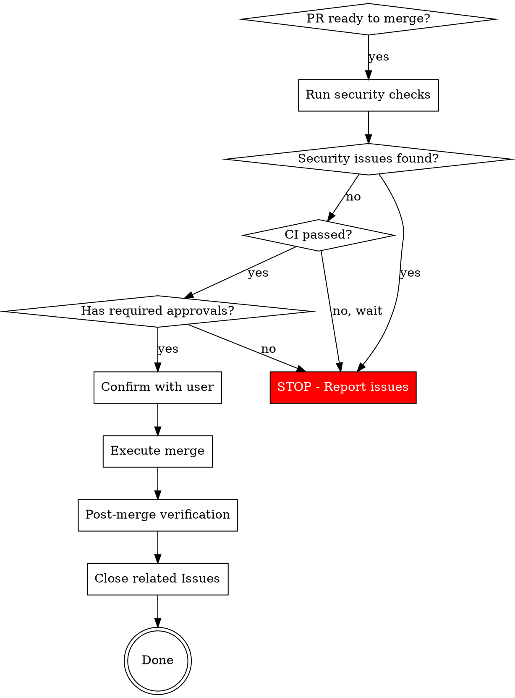

# Merge PR to Dev

## Overview

通过 PR 合并代码到 dev 分支，包含安全检查和 Issue 关闭。适用于需要 review 的正式流程。

**目标分支**：dev（开发分支）

**与 push-to-dev 的区别**：
- push-to-dev：直接合并，快速迭代
- merge-pr：通过 PR 合并，有 review 流程

## When to Use

- 合并 PR 到 dev 分支
- 需要 code review 的场景
- 多人协作的 PR
- User asks to "merge", "approve", or "complete" a PR

## Security Checklist (MANDATORY)



### 1. Pre-Merge Security Scan

Run these checks BEFORE asking user to confirm merge:

```bash
# View PR details and contributors
gh pr view <PR_NUMBER> --json author,commits,reviews,statusCheckRollup

# Check for secrets/credentials in changes
gh pr diff <PR_NUMBER> | grep -iE '(password|secret|api_key|token|private_key|credential|-----BEGIN)'

# Check for suspicious file patterns
gh pr diff <PR_NUMBER> --name-only | grep -E '\.(env|pem|key|p12|pfx|sh|exe|dll)$'

# Check for executable permission changes
gh pr diff <PR_NUMBER> | grep -E '^\+.*mode.*\+x|old mode|new mode'

# Check for large binary files (>1MB)
gh pr diff <PR_NUMBER> --name-only | while read f; do
  size=$(gh api repos/{owner}/{repo}/contents/$f?ref=<branch> --jq '.size // 0' 2>/dev/null)
  [ "$size" -gt 1048576 ] && echo "LARGE FILE: $f ($size bytes)"
done
```

### 2. CI Status (NEVER SKIP)

```bash
# Check CI status
gh pr checks <PR_NUMBER>

# If CI still running, set auto-merge instead of waiting
gh pr merge <PR_NUMBER> --auto --merge
```

**Red flags - STOP if user asks to:**
- Skip CI checks ("just merge it")
- Use `--admin` to bypass protections
- Merge with failing checks

### 3. Multi-Contributor Verification

For PRs with multiple contributors:

```bash
# List all contributors
gh pr view <PR_NUMBER> --json commits --jq '.commits[].authors[].login' | sort -u

# Verify each contributor
# - Are they org members or known external contributors?
# - Do commits have valid signatures (if required)?
```

### 4. Merge Execution

```bash
# Standard merge (preserves commit history)
gh pr merge <PR_NUMBER> --merge

# Squash merge (combines all commits)
gh pr merge <PR_NUMBER> --squash

# For hotfix to main
gh pr merge <PR_NUMBER> --merge --delete-branch
```

**Merge strategy:**
| Scenario | Strategy |
|----------|----------|
| Multi-contributor PR | `--merge` (preserve attribution) |
| Feature with messy history | `--squash` |
| Hotfix | `--merge --delete-branch` |

### 5. Post-Merge Verification

```bash
# Verify merge completed
gh pr view <PR_NUMBER> --json state,mergedAt

# Check target branch updated
git fetch origin
git log origin/<target_branch> --oneline -5
```

### 6. 调用 issue skill 标记部署完成并关闭

Merge 完成后，调用 `issue` skill 更新相关 Issues 状态。

**操作步骤：**

1. 查看 PR 关联的 issues：
```bash
gh pr view <PR_NUMBER> --json body | grep -oE '#[0-9]+'
gh issue list --state open --label "代码完成"
gh issue list --state open --label "测试完成"
```

2. 对比 PR 改动，识别已完成的 issues

3. 调用 issue skill 的"标记部署完成并关闭"操作：
```bash
# 添加 部署完成 标签
gh issue edit <ISSUE_NUMBER> --add-label "部署完成"

# 关闭并添加评论
gh issue close <ISSUE_NUMBER> --comment "已部署，完成于 PR #<PR_NUMBER>"
```

**参考 `issue` skill 获取完整的标签体系和状态流转规则。**

## Red Flags - STOP and Report

| Symptom | Action |
|---------|--------|
| Secrets in diff | **STOP** - Do not merge. Report to user. |
| Executable permission added | **WARN** - Ask user to justify |
| Large binary files | **WARN** - Ask if intentional |
| CI failing/pending | **WAIT** - Use --auto, never skip |
| No required approvals | **STOP** - Cannot merge |
| Unknown external contributor | **VERIFY** - Check with maintainers |

## Rationalization Table

| Excuse | Reality |
|--------|---------|
| "It's urgent" | Urgent merges cause bigger outages. Follow the process. |
| "I already tested locally" | Local ≠ CI/production. Wait for CI. |
| "It's just 20 lines" | Small changes cause big incidents. Check anyway. |
| "Skip this one time" | There's never "one time". Process exists for a reason. |
| "User has admin rights" | Rights ≠ correctness. Still verify. |

## Common Mistakes

1. **Merging without checking CI** - Always verify `gh pr checks` passes
2. **Ignoring security scan** - Run grep for secrets EVERY time
3. **Force merging** - Never use `--admin` without explicit user request
4. **Skipping multi-contributor review** - Each contributor's code needs verification

## Quick Reference

```bash
# Safe merge workflow
gh pr view <N>                    # Review PR
gh pr checks <N>                  # Verify CI
gh pr diff <N> | grep -i secret   # Security scan
gh pr merge <N> --merge           # Execute merge
gh issue list --state open --label task  # Check open issues
gh issue close <N> --comment "完成于 PR #<PR>"  # Close issues
```
