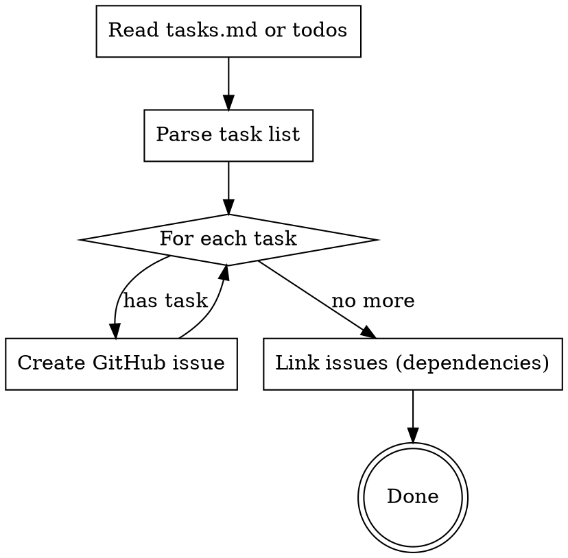

# Tasks to GitHub Issues

## Overview

Convert tasks from OpenSpec `tasks.md` or any structured task list into GitHub issues. Each task becomes a trackable, assignable issue.

## When to Use

- After creating an OpenSpec proposal with `tasks.md`
- When you want to make planned work visible to collaborators
- Before starting implementation to track progress publicly

## Quick Reference

| Source | Command |
|--------|---------|
| OpenSpec tasks.md | Parse markdown, create issues per task |
| TodoWrite list | Convert current todos to issues |

## Workflow



## Implementation

### 1. Parse Tasks

From OpenSpec `tasks.md`:
```markdown
- [ ] **T1**: 创建 news 表
- [ ] **T2**: Hasura 追踪 news 表
```

Extract: task ID, description, dependencies (from dependency graph if present).

### 2. Create Issues

Use `gh issue create`:

```bash
gh issue create \
  --title "T1: 创建 news 表" \
  --body "$(cat <<'EOF'
## 任务描述
创建 `db/init/04_news.sql`，定义 `news` 表

## 来源
- Proposal: `openspec/changes/add-news-crawler/proposal.md`
- Tasks: `openspec/changes/add-news-crawler/tasks.md`

## 验证标准
Hasura Console 可查询 `news` 表
EOF
)" \
  --label "task"
```

### 3. Link Dependencies

If T2 depends on T1, add to T2's body:
```markdown
## 依赖
- Blocked by #123 (T1: 创建 news 表)
```

## Issue Body Template

```markdown
## 任务描述
{task_description}

## 来源
- Proposal: `{proposal_path}`
- Tasks: `{tasks_path}`

## 依赖
{dependencies_list or "无"}

## 验证标准
{verification_criteria}
```

## Labels

Create these labels if not exist:
- `task` - From tasks.md
- `phase-0`, `phase-1`, etc. - Phase tracking
- `blocked` - Has unmet dependencies

## Common Mistakes

| Mistake | Fix |
|---------|-----|
| Creating issues without linking proposal | Always include source path |
| Missing verification criteria | Copy from tasks.md "验证" section |
| No dependency tracking | Parse dependency graph, add "Blocked by" |
