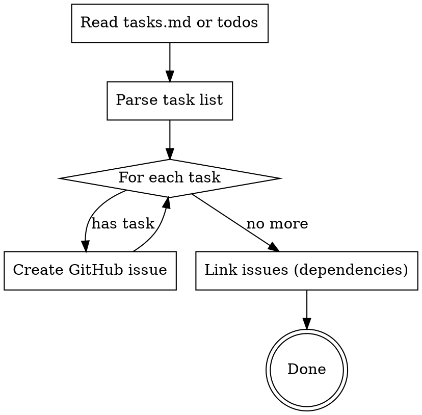

# Tasks to GitHub Issues

## Overview

**双向同步** tasks 和 GitHub Issues：
1. **发布方向**：将本地 tasks.md 转换为 GitHub Issues
2. **查找方向**：从 GitHub Issues 找到可以认领的任务

## When to Use

- After creating an OpenSpec proposal with `tasks.md`
- When you want to make planned work visible to collaborators
- Before starting implementation to track progress publicly
- **查找可用任务**：想知道有什么任务可以做
- **认领任务**：开始做某个 Issue 前标记为进行中
- **避免重复开发**：检查某功能是否已有人在做

## Quick Reference

| 方向 | 用途 | 命令 |
|------|------|------|
| 发布 | tasks.md → Issues | `gh issue create` |
| 发布 | TodoWrite → Issues | `gh issue create` |
| 查找 | 查看可用任务 | `gh issue list --label task --state open` |
| 认领 | 开始做任务 | `gh issue edit <N> --add-label in-progress` |

---

# Part 1: 从 GitHub Issue 查找 Task

## 查找可用任务

### 1. 列出所有开放的任务

```bash
# 查看所有开放的 task issues
gh issue list --state open --label task

# 只看未被认领的任务（没有 in-progress 标签）
gh issue list --state open --label task | grep -v "in-progress"

# 查看某个 phase 的任务
gh issue list --state open --label task --label phase-0
```

### 2. 查看任务详情

```bash
# 查看单个 issue 的详细信息
gh issue view <ISSUE_NUMBER>

# 查看 issue 的标签（判断状态）
gh issue view <ISSUE_NUMBER> --json labels --jq '.labels[].name'
```

### 3. 任务状态说明

| 标签组合 | 状态 | 含义 |
|----------|------|------|
| `task` | 待认领 | 没人在做，可以开始 |
| `task, in-progress` | 进行中 | 有人正在做 |
| `task, blocked` | 阻塞 | 有依赖未完成 |
| `task, ready-for-review` | 等待审核 | 开发完成，等待 merge |

## 认领任务

开始做某个任务前，**必须先认领**，避免重复开发：

```bash
# 1. 添加 in-progress 标签
gh issue edit <ISSUE_NUMBER> --add-label "in-progress"

# 2. 添加评论说明你在做
gh issue comment <ISSUE_NUMBER> --body "开始开发此任务"

# 3. （可选）分配给自己
gh issue edit <ISSUE_NUMBER> --add-assignee @me
```

## 检查是否有人在做

在开始新功能前，先检查是否已有相关 Issue：

```bash
# 搜索关键词
gh issue list --state open --search "关键词"

# 例如：检查是否有人在做"新闻爬虫"
gh issue list --state open --search "新闻 OR news OR crawler"
```

**如果找到相关 Issue：**
- 查看是否有 `in-progress` 标签
- 如果有，联系该开发者协调
- 如果没有，认领后开始开发

---

# Part 2: 创建 GitHub Issues（发布方向）

## Workflow



## Implementation

### 1. Parse Tasks

From OpenSpec `tasks.md`:
```markdown
- [ ] **T1**: 创建 news 表
- [ ] **T2**: Hasura 追踪 news 表
```

Extract: task ID, description, dependencies (from dependency graph if present).

### 2. Create Issues

Use `gh issue create`:

```bash
gh issue create \
  --title "T1: 创建 news 表" \
  --body "$(cat <<'EOF'
## 任务描述
创建 `db/init/04_news.sql`，定义 `news` 表

## 来源
- Proposal: `openspec/changes/add-news-crawler/proposal.md`
- Tasks: `openspec/changes/add-news-crawler/tasks.md`

## 验证标准
Hasura Console 可查询 `news` 表
EOF
)" \
  --label "task"
```

### 3. Link Dependencies

If T2 depends on T1, add to T2's body:
```markdown
## 依赖
- Blocked by #123 (T1: 创建 news 表)
```

## Issue Body Template

```markdown
## 任务描述
{task_description}

## 来源
- Proposal: `{proposal_path}`
- Tasks: `{tasks_path}`

## 依赖
{dependencies_list or "无"}

## 验证标准
{verification_criteria}
```

## Labels

Create these labels if not exist:
- `task` - From tasks.md
- `phase-0`, `phase-1`, etc. - Phase tracking
- `blocked` - Has unmet dependencies
- `in-progress` - 正在开发中
- `ready-for-review` - 已完成开发，等待审核

## Issue 状态流转 (Issue-Driven Development)

```
[task]              创建 issue (tasks-to-issues)
   ↓
[task, in-progress] 开始开发
   ↓
[task, ready-for-review]  push-to-dev 后标记
   ↓
Closed              merge-pr 后关闭
```

## Common Mistakes

### 发布方向

| Mistake | Fix |
|---------|-----|
| Creating issues without linking proposal | Always include source path |
| Missing verification criteria | Copy from tasks.md "验证" section |
| No dependency tracking | Parse dependency graph, add "Blocked by" |

### 查找方向

| Mistake | Fix |
|---------|-----|
| 直接开始开发，不检查 Issues | 先 `gh issue list` 查看是否已有人在做 |
| 不认领就开始做 | 先 `gh issue edit <N> --add-label in-progress` |
| 做完不更新状态 | 用 push-to-dev 自动标记 ready-for-review |
| 忽略 blocked 标签 | 先完成依赖任务，或联系相关开发者 |

---

# 完整工作流示例

## 场景：加入项目，想找任务做

```bash
# 1. 查看有什么任务可以做
gh issue list --state open --label task

# 2. 选择一个感兴趣的任务，查看详情
gh issue view 15

# 3. 确认没有 in-progress 标签后，认领任务
gh issue edit 15 --add-label "in-progress"
gh issue comment 15 --body "开始开发此任务"

# 4. 创建分支开始开发
git checkout -b username/feature-name

# 5. 开发完成后，使用 push-to-dev（自动标记 ready-for-review）
# 6. 创建 PR，使用 merge-pr（自动关闭 Issue）
```

## 场景：有新功能想法，发布给团队

```bash
# 1. 先检查是否已有类似 Issue
gh issue list --state open --search "功能关键词"

# 2. 如果没有，创建新 Issue
gh issue create \
  --title "T1: 功能描述" \
  --body "任务详情..." \
  --label "task"

# 3. 自己要做的话，同时认领
gh issue edit <新Issue编号> --add-label "in-progress"
```
